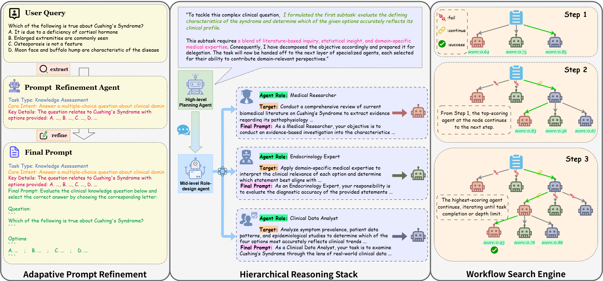
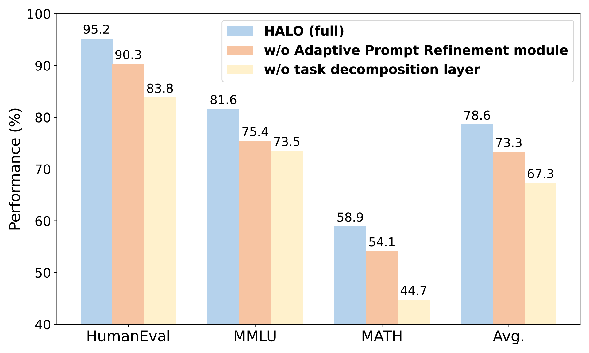

<!-- markdownlint-disable MD033 -->

<h1 align="center">
    HALO: Hierarchical Autonomous Logic-Oriented Orchestration for Multi-Agent LLM Systems
</h1>

<div align="center">
  
  <a href="https://arxiv.org/abs/2505.13516"></a>
  
</div>

<p align="center">
  <br>
  <b>Authors: </b>
  <a href="https://www.semanticscholar.org/author/Zhipeng-Hou/2307312578">Zhipeng Hou</a>,
  <a href="https://github.com/Haaareally">Junyi Tang</a>,
  <a href="https://github.com/Xwwww-yp">Yipeng Wang</a>
  <br>
  <b>Email: </b>
  <a href="mailto:japhonehou@gmail.com">japhonehou@gmail.com</a>
</p>

<!-- markdownlint-enable MD033 -->

---

## 📌Citation

If you find our work useful in your research, please consider citing the HALO as follows:

```latex
@misc{hou2025halohierarchicalautonomouslogicoriented,
      title={HALO: Hierarchical Autonomous Logic-Oriented Orchestration for Multi-Agent LLM Systems}, 
      author={Zhipeng Hou and Junyi Tang and Yipeng Wang},
      year={2025},
      eprint={2505.13516},
      archivePrefix={arXiv},
      primaryClass={cs.MA},
      url={https://arxiv.org/abs/2505.13516}, 
}
```

## 📋️Overview



<!-- markdownlint-disable MD033 -->

<details><summary>Abstract</summary>
    Recent advancements in Multi-Agent Systems (MAS) powered by Large Language Models (LLMs) have demonstrated tremendous potential in diverse task scenarios. Nonetheless, existing agentic systems typically rely on predefined agent-role design spaces and static communication structures, limiting their adaptability as well as flexibility in complex interaction environments and leading to subpar performance on highly specialized and expert-level tasks. To address these issues, we introduce HALO, a multi-agent collaboration framework based on a hierarchical reasoning architecture. Specifically, we incorporate a high-level planning agent for task decomposition, mid-level role-design agents for subtask-specific agent instantiation, and low-level inference agents for subtask execution. Particularly, subtask execution is reformulated as a structured workflow search problem, where Monte Carlo Tree Search (MCTS) systematically explores the agentic action space to construct optimal reasoning trajectories. Additionally, as the majority of users lack expertise in prompt engineering, we leverage an Adaptive Prompt Refinement module to transform raw queries into task-specific prompts. Empirical evaluations on Code Generation (HumanEval), General Reasoning (MMLU), and Arithmetic Reasoning (MATH) benchmark datasets highlight the effectiveness of HALO, yielding a 14.4% average improvement over state-of-the-art baselines. Notably, HALO achieves up to 13.3% performance gain on the Moral Scenarios subject in the MMLU benchmark and up to 19.6% performance gain on the Algebra subarea in the MATH benchmark, indicating its advanced proficiency in tackling highly specialized and expert-level tasks.
</details>

<!-- markdownlint-enable MD033 -->

## ⚙️Installation

### 1. Create virtualenv (recommended)

```bash
conda create -n halo python=3.10
conda activate halo
```

### 2. Install packages

```bash
pip install -r requirements.txt
```

## 🔛Quick Start

### 1. Create Api config file

Create `api_setting.json` file in `HALO/configs` directory and insert the following contents (GPT-4o is recommended):

```json
{
    "endpoints": "<base_url>/chat/completions",
    "api_key": "sk-xxx",
    "model": "xxx"
}
```

### 2. Modify user query (optional)

Locate the code between "user input begin" section and "user input ended" section in `HALO/run.py` script. You can modify the "QUERY" as what you want to ask.

### 3. Run script (make sure to run in the `HALO` directory)

```bash
python run.py
```

## 📝Experiments

Performance of HALO across three benchmarks. Metrics include $pass@1$ (%) for HumanEval, $accuracy$ (%) for MMLU as well as MATH, and $Avg.$ (%) for the mean performance over three runs. All methods are executed with GPT-4o.

|             | Structure                        | HumanEval | MMLU | MATH | Avg. |
|:-----------:|:--------------------------------:|:---------:|:----:|:----:|:----:|
| HALO (Ours) | Hierarchical architecture + MCTS | 95.2      | 81.6 | 58.9 | 78.6 |

Ablation study of removing the Adaptive Prompt Refinement module and the high-level planning agent on GPT-4o across three benchmarks.



### 1. HumanEval

#### 1.1 For windows, modify `human-eval` package script, [please refer here](https://github.com/openai/human-eval/issues/45#issuecomment-2194144978)

#### 1.2 Run script (make sure to run in the `HALO` directory)

```python
python ./experiment/human_eval/run.py
```

#### 1.3 View the results in the `HALO/experiment/human_eval/results` directory

### 2. MMLU

#### 2.1 [**Download**](https://people.eecs.berkeley.edu/~hendrycks/data.tar) MMLU datasets

#### 2.2 Unzip datasets and rename `MMLU_data`, move it into `HALO/experiment/MMLU` directory

#### 2.3 Run script (make sure to run in the `HALO` directory)

```python
python ./experiment/MMLU/run.py
```

#### 2.4 View the results in the `HALO/experiment/MMLU/results` directory

### 3. MATH

#### 3.1 [**Download**](https://www.modelscope.cn/datasets/opencompass/competition_math/resolve/master/data/MATH.zip) MATH datasets

#### 3.2 Unzip datasets and rename `MATH_data`, move it into `HALO/experiment/MATH` directory

#### 3.3 Run script (make sure to run in the `HALO` directory)

```python
python ./experiment/MATH/run.py
```

#### 3.4 View the results in the `HALO/experiment/MATH/results` directory

### 4. Ablation study

#### 4.1 Run script (make sure to run in the `HALO` directory)

```python
python ./experiment/ablation_study/run_humaneval_w_o_prompt.py
python ./experiment/ablation_study/run_humaneval_w_o_task.py
python ./experiment/ablation_study/run_math_w_o_prompt.py
python ./experiment/ablation_study/run_math_w_o_task.py
python ./experiment/ablation_study/run_mmlu_w_o_prompt.py
python ./experiment/ablation_study/run_mmlu_w_o_task.py
```

#### 4.2 View the results in the `HALO/experiment/ablation_study/results` directory

## 🎀Acknowledgement

In our experiments, data preprocessing was standardized across all tasks. Thus, we referred to [DyLAN](https://github.com/SALT-NLP/DyLAN), [HumanEval](https://github.com/openai/human-eval), [MMLU](https://github.com/hendrycks/test), and [MATH](https://github.com/hendrycks/math) in this stage.

## ⭐Star History

[](https://star-history.com/#23japhone/HALO&Date)
